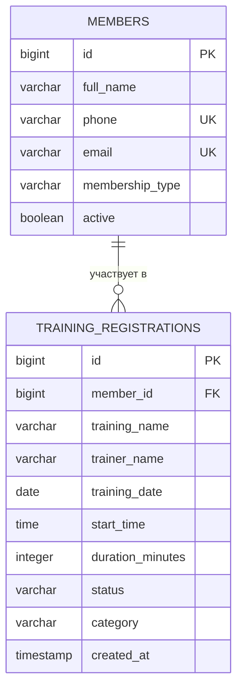

# ER-диаграмма

```mermaid
erDiagram
    MEMBERS ||--o{ TRAINING_REGISTRATIONS : "участвует в"
    MEMBERS {
        bigint id PK
        varchar full_name
        varchar phone UK
        varchar email UK
        varchar membership_type
        boolean active
    }
    TRAINING_REGISTRATIONS {
        bigint id PK
        bigint member_id FK
        varchar training_name
        varchar trainer_name
        date training_date
        time start_time
        integer duration_minutes
        varchar status
        varchar category
        timestamp created_at
    }
```

Связь `training_registrations.member_id -> members.id` обязательна и защищена внешним ключом.
